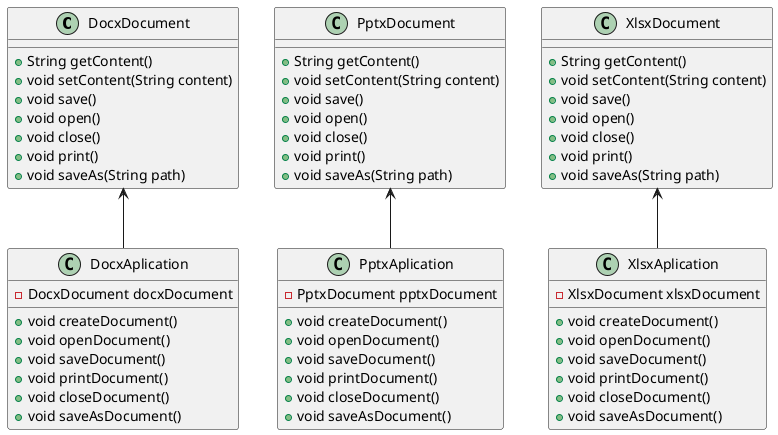
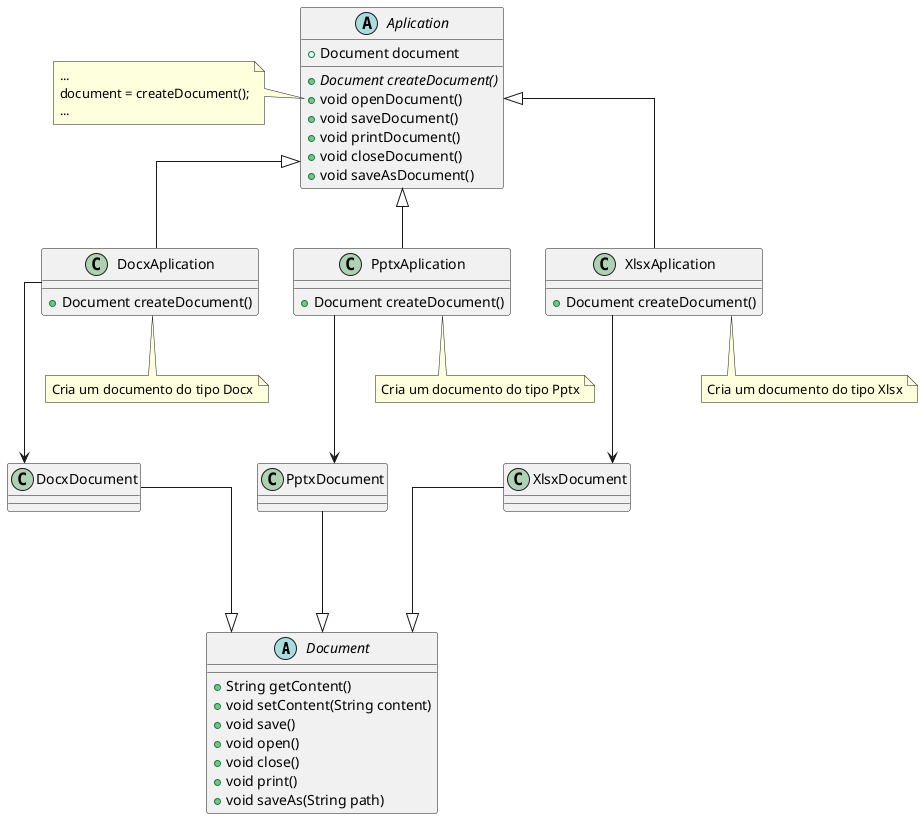
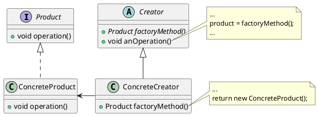

# Factory Method

[^GAMMA]    

## Intenção

Definir uma interface para criar um objeto, mas deixar as subclasses decidirem que classe instanciar. O Factory Method permite adiar a instanciação para subclasses.

## Também conhecido como

Virtual Constructor

## Motivação

Considere um sistema de gestão de documentos para escritórios. Ele deve ser capaz de criar documentos em diferentes formatos, como `docx`, `pptx` e `xlsx`.

O tratamento de cada formato de documento é feito por uma classe específica. Essas classes são responsáveis por criar e manipular os documentos em seus respectivos formatos.

<figure>

<figcaption>Diagrama de classes do sistema de gestão de documentos</figcaption>
</figure>

Os frameworks usam classes abstratas para definir e manter relacionamentos entre objetos. Um framework é frequentemente responsável também pela criação desses  objetos

Refatorando o código para usar o padrão Factory Method, podemos criar uma classe abstrata chamada `Document` que será a representação de um documento genérico. Essa classe terá métodos abstratos para criar, abrir, salvar, imprimir e salvar como.

Devemos ter uma classe abstrata chamada `Aplication` que será a representação de uma aplicação genérica. Essa classe terá métodos abstratos para criar, abrir, salvar, imprimir e salvar como documento.

A classe `Aplication` terá um método chamado `createDocument` que será responsável por criar um documento, mas nesse momento não sabemos qual tipo de documento será criado. Esse método será abstrato e será implementado pelas subclasses, postergando a decisão de qual tipo de documento será criado.

<figure>

<figcaption>Diagrama de classes do sistema de gestão de documentos refatorado</figcaption>
</figure>

## Estrutura

<figure>

<figcaption>Estrutura do padrão Factory Method</figcaption>
</figure>

## Participantes

- **Product (Document)**: Representa o produto que será criado pelo Creator.
- **ConcreteProduct (DocxDocument, PptxDocument, XlsxDocument)**: Representa um produto concreto que será criado pelo Creator.
- **Creator (Aplication)**: É a classe abstrata que define o método de fábrica que será implementado pelas subclasses.
- **ConcreteCreator (DocxAplication, PptxAplication, XlsxAplication)**: Representa uma classe concreta que implementa o método de fábrica.

## Referências

<!-- @include: ../../../../includes/bib.md -->
