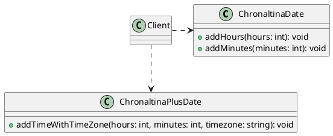
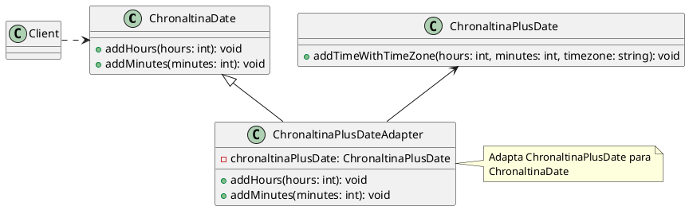
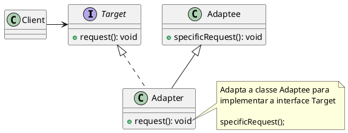
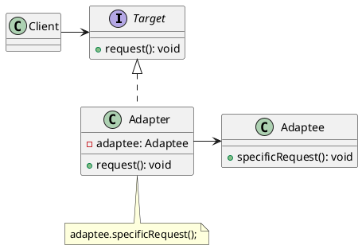

# Adapter

[^GAMMA]

## Intenção

Converter a interface de uma classe em outra interface, esperada pelos clientes. O Adapter permite que classes com interfaces incompatíveis trabalhem em conjunto – o que, de outra forma, seria impossível.

O padrão Adapter permite que classes com interfaces incompatíveis trabalham em conjunto. É um padrão de projeto estrutural que pode ser usado para resolver problemas de compatibilidade entre classes.

## Também conhecido como

Wrapper

## Motivação

Cada biblioteca segue um padrão de desenvolvimento que define como os objetos devem ser criados, compostos e acessados. A partir dessas definições são escolhidos os métodos das classes e interfaces. É possível encontrar varias bibliotecas diferentes para a mesma tarefa ou ate mesmo bibliotecas complementares.

Considere uma situação onde esta sendo desenvolvida uma aplicação que nela será necessário fazer o controle de um cronograma, tratando as varias questões que envolve os cálculos com datas e horas.

Em um primeiro momento foi utilizada uma biblioteca chamada Chronaltina. Essa biblioteca possui uma classe chamada `ChronaltinaDate` que é responsável por fazer adição de datas e horas. 

Todo o sistema foi desenvolvido e funcionou bem, porém, após um tempo foi necessário fazer uma alteração no sistema. Nessa alteração foi necessário fazer com que o sistema trabalhasse com o controle de fuso horário, o que não era previsto pela biblioteca Chronaltina.

Foi necessário buscar uma nova biblioteca para contemplar esse novo requisito do sistema. 

A equipe de pesquisa encontrou uma nova biblioteca chamada GlobalChronaltinaPlus. Essa biblioteca possui uma classe chamada `ChronaltinaPlusDate` que é responsável por fazer adição de datas, horas e considera fuso horário.

Seria extremamente desgastante e custoso para o sistema ter que utilizar duas bibliotecas diferentes para o mesmo trabalho e a refatoração seria muito custosa.

<figure>

<figcaption>Uso de duas bibliotecas pelo cliente</figcaption>
</figure>

A solução encontrada foi a utilização do padrão Adapter. 

Para que a classe  `ChronaltinaPlusDate` seja utilizada pelo sistema, foi necessário criar uma classe chamada `ChronaltinaPlusDateAdapter` que é responsável por adaptar a biblioteca `ChronaltinaPlusDate` para que ela seja utilizada pelo sistema "fazendo de conta" que ela é a `ChronaltinaDate`.

<figure>

<figcaption>Aplicação do padrão Adapter</figcaption>
</figure>

## Estrutura

### Adaptador de classe

um adapter de classe é uma classe que herda de uma classe alvo e implementa uma interface alvo. O adaptador de classe é usado quando é necessário adaptar uma classe existente para que ela possa ser usada em um contexto que exige uma interface diferente.

<figure>

<figcaption>Estrutura do Adapter de classe</figcaption>

</figure>

### Adaptador de objeto

um adapter de objeto é um objeto que encapsula um objeto alvo e fornece uma interface diferente para o objeto alvo. O adaptador de objeto é usado quando é necessário adaptar um objeto existente para que ele possa ser usado em um contexto que exige uma interface diferente.

<figure>

<figcaption>Estrutura do Adapter de objeto</figcaption>
</figure>

## Participantes

- **Client (Client)**: é o cliente que usa a interface Target (ChronaltinaDate).
- **Target (ChronaltinaDate)**: define a interface que o cliente usa.
- **Adaptee (ChronaltinaPlusDate)**: é a classe que precisa ser adaptada para que ela possa ser usada pelo cliente.
- **Adapter (ChronaltinaPlusDateAdapter)**: é a classe que adapta a classe Adaptee para que ela possa ser usada pelo cliente.

## Referências

<!-- @include: ../../../../includes/bib.md -->
