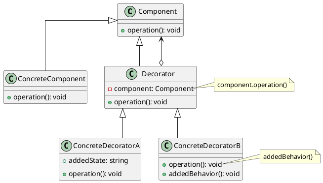

# Decorator

[^GAMMA]    

Dinamicamente, agregar responsabilidades adicionais a um objeto. Os Decorators fornecem uma alternativa flexível ao uso de subclasses para extensão de funcionalidades.

## Intenção

Com o decorador, podemos adicionar funcionalidades a um objeto sem ter que alterar a classe do objeto.

## Também conhecido como

Wrapper

## Motivação

## Estrutura

<figure>

<figcaption>Estrutura do Decorator</figcaption>

</figure>

## Participantes
- Component
  - define a interface para objetos que podem ter responsabilidades acrescenta das aos mesmos dinamicamente.
- ConcreteComponent 
  - define um objeto para o qual responsabilidades adicionais podem ser atribuídas.
- Decorator
  - mantém uma referência para um objeto Component e define uma interface que segue a interface de Component.
- ConcreteDecorator 
  - acrescenta responsabilidades ao componente.

## Referências

<!-- @include: ../../../../includes/bib.md -->
