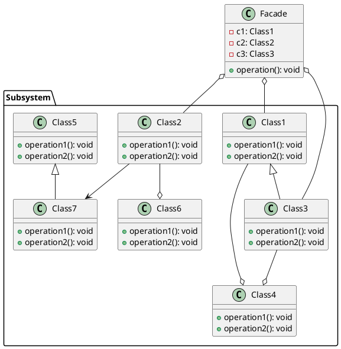

# Facade

[^GAMMA]    

## Intenção

A intenção do padrão de projeto facade é fornecer uma interface unificada para um conjunto de interfaces em um subsistema.

Facade define uma interface de nível mais alto que torna o subsistema mais fácil de ser usado.

## Motivação

Apresenta uma situação em que o padrão de projeto Facade pode ser aplicado. O padrão Facade fornece uma interface unificada para um conjunto de interfaces em um subsistema, tornando o subsistema mais fácil de ser usado.

## Estrutura

<figure>

<figcaption>Estrutura do Facade</figcaption>

</figure>

## Participantes

- Facade 
  - define uma interface de nível mais alto que torna o subsistema mais fácil de ser usado;
  - conhece quais as classes do subsistema são responsáveis pelo atendimento de uma solicitação;
  - delega solicitações de clientes a objetos apropriados do subsistema.
- Classes de subsistema 
  - implementam a funcionalidade do subsistema;
  - encarregam-se do trabalho atribuído a elas pelo objeto Façade;
  - não têm conhecimento da façade; isto é, não mantêm referências para a mesma

## Referências

<!-- @include: ../../../../includes/bib.md -->
